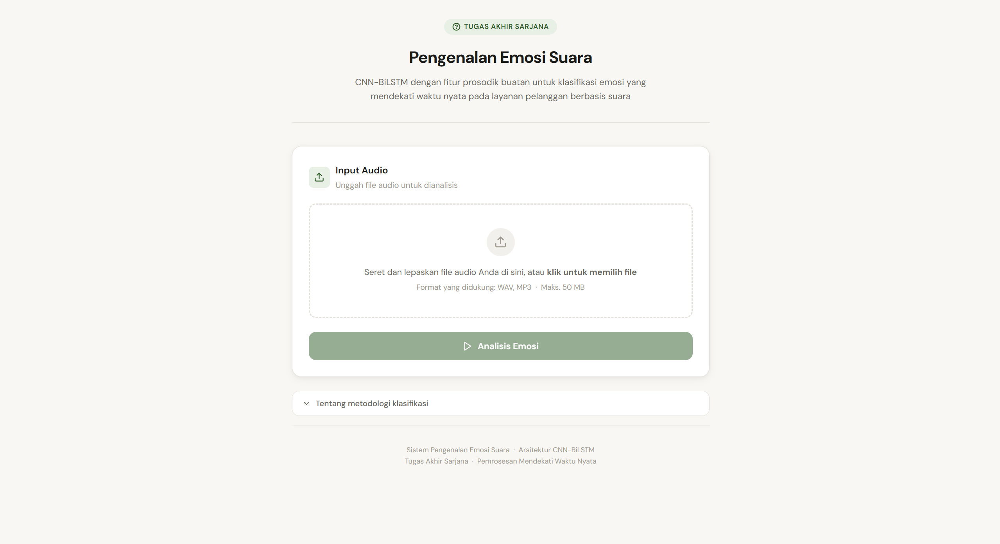
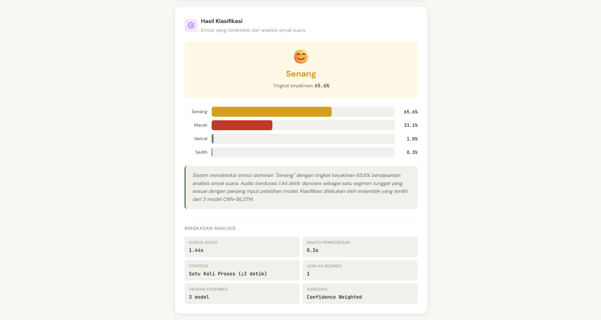

# Speech Emotion Recognition (SER) — CNN-BiLSTM + Prosodic Features

Skripsi ini membangun sistem **Speech Emotion Recognition (SER)** yang bersifat **speaker-independent**, menggunakan arsitektur hybrid **CNN-BiLSTM** yang menggabungkan fitur log-mel spectrogram dengan fitur prosodik (pitch, energi, dsb.) secara eksplisit, serta **attention-based temporal pooling** dan **ensemble learning** untuk meningkatkan akurasi klasifikasi emosi dari ucapan.

Model mengklasifikasikan audio ucapan ke dalam 4 kategori emosi: **angry, happy, sad, neutral**.

## Dataset

Proyek ini menggunakan **[CREMA-D](https://github.com/CheyneyComputerScience/CREMA-D)** (Crowd-sourced Emotional Multimodal Actors Dataset) — 7.442 klip audio dari 91 aktor. Dari dataset tersebut, hanya 4 kelas emosi (`angry`, `happy`, `sad`, `neutral`) yang digunakan pada eksperimen ini.

> Dataset tidak disertakan dalam repo ini. Unduh dari link di atas dan letakkan pada `../content/DATASET/CREMA/*.wav` (atau sesuaikan path `DATASET_DIR` di notebook).

## Kontribusi Utama

- **Protokol speaker-independent yang ketat** — split train/val/test (70/15/15) dilakukan berdasarkan speaker, sehingga tidak ada satu pun speaker yang muncul di lebih dari satu split.
- **Arsitektur hybrid** — menggabungkan fitur spectrogram hasil ekstraksi CNN dengan fitur prosodik yang dihitung secara eksplisit (handcrafted).
- **Attention-based temporal pooling** untuk menangkap sinyal emosi pada durasi yang bervariasi.
- **Focal loss** untuk mengatasi ketidakseimbangan kelas dan menekankan sampel yang sulit diklasifikasikan.
- **Ensemble 3 model** (seed berbeda) untuk menstabilkan dan meningkatkan performa akhir.

## Arsitektur Model

Model memiliki dua cabang input yang digabung (merge) sebelum masuk ke BiLSTM:

1. **CNN branch** — menerima log-mel spectrogram (`128 mel bins × frame`), melewati 4 blok `Conv2D → BatchNorm → ReLU → MaxPool → Dropout` (filter 32→64→128→256, dropout 0.2→0.4) dengan regularisasi L2, diikuti satu conv block tambahan untuk menyelaraskan dimensi ke sequence.
2. **Sequence branch** — 9 fitur prosodik per frame (pitch/F0, RMS energy, spectral centroid, bandwidth, rolloff, zero-crossing rate, spectral contrast) yang digabung dengan output CNN yang telah di-reshape menjadi sequence.
3. **BiLSTM** — 2 layer `Bidirectional LSTM` (128 lalu 64 unit) dengan regularisasi L2.
4. **Attention pooling** — bobot perhatian dipelajari melalui `Dense(1) → Softmax` untuk melakukan weighted pooling atas seluruh timestep.
5. **Classification head** — `Dense(128, relu) → Dropout(0.5) → Dense(4, softmax)`.

Loss function: **focal loss** (sparse, softmax). Optimizer: **Adam** (learning rate `3e-4`).

## Pipeline Preprocessing & Augmentasi

- Audio di-resample ke **16 kHz**, durasi tetap **3 detik**, silence trimming.
- Fitur spectrogram: log-mel spectrogram (`n_mels=128, n_fft=512, hop_length=256`).
- Augmentasi (khusus data training, konservatif agar karakteristik emosi tetap terjaga):
  - **Time shift** (±100ms)
  - **White noise** (SNR 25–35 dB)
  - **Random gain** (0.8x–1.2x)
  - *Pitch shifting sengaja dihindari* karena pitch adalah cue penting untuk emosi.

## Training

| Parameter | Nilai |
|---|---|
| Batch size | 32 |
| Max epochs | 60 |
| Optimizer | Adam (lr = 3e-4) |
| Loss | Focal loss |
| Regularisasi | L2 (5e-4), Dropout, SpecAugment |
| Ensemble seeds | 42, 123, 2024 |

## Hasil (Ensemble 3 Model + SpecAugment + L2 5e-4)

| Split | Accuracy | Macro F1 |
|---|---|---|
| Validation | 75.78% | 0.7562 |
| Test | 81.71% | 0.8160 |

Confusion matrix dan detail hasil evaluasi lainnya tersedia di [`outputs/evaluation/`](outputs/evaluation).

## Tampilan Aplikasi

Model ensemble hasil pelatihan di repo ini dipakai pada sebuah prototipe aplikasi web (Flask) untuk melakukan inferensi emosi dari file audio yang diunggah pengguna. Berikut tampilannya.

### Halaman input audio

Pengguna mengunggah file audio (WAV/MP3, maks. 50 MB) lewat drag-and-drop, lalu menekan tombol **Analisis Emosi**.



### Halaman hasil klasifikasi

Sistem menampilkan emosi dominan beserta tingkat keyakinan, distribusi probabilitas keempat kelas emosi, penjelasan naratif hasil klasifikasi, serta ringkasan analisis (durasi audio, waktu pemrosesan, strategi inferensi, jumlah segmen, ukuran ensemble, dan metode agregasi).



Strategi inferensi yang dipakai aplikasi: audio ≤ 3 detik diproses satu kali (single pass), audio > 3 detik dipotong dengan sliding window 3 detik (stride 1,5 detik / overlap 50%) lalu digabung dengan **confidence-weighted aggregation** atas prediksi ensemble 3 model.

> Kode aplikasi web tidak disertakan dalam repo ini — repo ini fokus pada eksperimen, pelatihan, dan evaluasi model.

## Struktur Repo

```
.
├── SER_Thesis_Final (Ensemble).ipynb   # Notebook utama: preprocessing, training, evaluasi model ensemble
├── analyze_emotion.ipynb               # Notebook analisis kualitatif prediksi benar/salah per emosi
├── docs/
│   └── screenshots/                    # Tangkapan layar tampilan aplikasi web
└── outputs/
    ├── audio_examples/                 # Contoh audio asli & hasil augmentasi
    ├── evaluation/                     # Confusion matrix, prediksi, dan ringkasan metrik ensemble
    ├── figures/                        # Visualisasi (distribusi emosi, spectrogram, training curve, dll.)
    └── models/                         # Model terlatih (.keras) per seed + scaler & label encoder
```

## Cara Menjalankan

1. Unduh dataset [CREMA-D](https://github.com/CheyneyComputerScience/CREMA-D) dan letakkan di `../content/DATASET/CREMA/`.
2. Install dependency:
   ```bash
   pip install numpy pandas librosa soundfile matplotlib seaborn joblib scikit-learn tensorflow
   ```
3. Jalankan `SER_Thesis_Final (Ensemble).ipynb` dari awal hingga akhir untuk melatih ulang model dan menghasilkan seluruh artefak di `outputs/`.
4. (Opsional) Jalankan `analyze_emotion.ipynb` setelah cell evaluasi ensemble selesai dijalankan, untuk melihat analisis sampel prediksi benar/salah per kelas emosi.

## Catatan

Model dan seluruh artefak pada `outputs/` merupakan hasil eksperimen skripsi ini dan disertakan sebagai referensi/reproduksi hasil.
